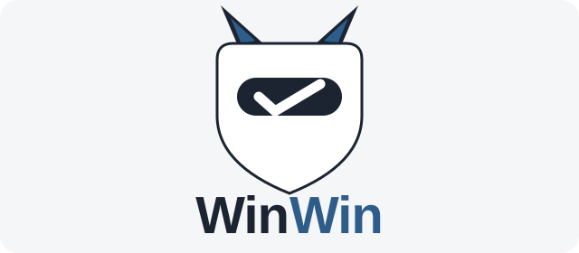
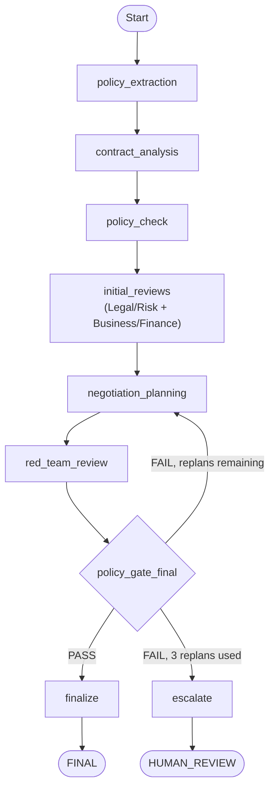

<p align="center">
  
</p>

<h1 align="center">WinWin</h1>

<p align="center">
  <em>WinWin lets AI negotiate vendor contracts, but puts every AI-generated
  negotiation move through an enforceable policy, evidence, and
  independent-review harness before allowing it to proceed.</em>
</p>

<p align="center">
  Built for <strong>The Harness Engineering Hackathon</strong> (Pune, with Michelin x AI Tinkerers) — Domain: Operations &amp; Compliance
</p>

---

## The Problem

Corporate legal and procurement teams face a massive bottleneck reviewing
standard vendor contracts. While LLMs promise automation, they are
structurally unreliable for legal negotiation — they hallucinate numbers,
misquote clauses, and subtly drift from strict corporate policies (like
maximum liability caps) when trying to act "reasonable" in a prompt. WinWin
solves this by wrapping LLMs in a strict, deterministic harness that
separates the AI's reasoning capabilities from mathematical policy
enforcement.

## Harness Design & Agent Roles

WinWin is built as a LangGraph state machine where agents pass structured
data through deterministic gates. Six agents and one deterministic gate,
kept separate on purpose so independent judgments stay independent:

| Component | Role | Constraint |
|---|---|---|
| **Contract Analyst Agent** | Extracts structured evidence (clause values, source text, confidence) from the uploaded vendor contract PDF into strict Pydantic schemas. | LLM call — reasoning only, never judges evidence against policy. |
| **Policy Analyst Agent** | Extracts the company's negotiation policy from an uploaded policy PDF, if one is provided. | LLM call — only fills numeric target/hard-limit values; below a 0.7 confidence threshold (or if not found), the rule falls back to the shipped default rather than guessing. |
| **Policy Gate** (harness) | Pure Python, no LLM: mathematically compares extracted clauses against company policy and labels every rule. | Deterministic. Real statuses: `PASS`, `BLOCKED`, `CONFLICTING`, `CANNOT_VERIFY`, `LOW_CONFIDENCE`. The LLM cannot bypass this logic. |
| **Negotiation Agent** | Proposes concessions and requested changes based on the Policy Gate's output and the two independent reviews below. | LLM call — every claim must cite a real `clause_id`; checked by the deterministic Grounding Check before acceptance. |
| **Legal/Risk Agent** | Independently reviews the extracted evidence and policy results for legal/compliance risk. | LLM call — separate prompt and verdict from Business/Finance, by design. |
| **Business/Finance Agent** | Independently reviews the same evidence for commercial and financial risk. | LLM call — can legitimately reach a different verdict than Legal/Risk. |
| **Red-Team Agent** | Independently challenges the Negotiation Agent's proposal before it can be approved. | LLM call — a `REJECT` verdict alone fails the Policy Gate, same as a hard policy violation. |

## State Machine

The actual graph, as wired in `harness/graph.py`:



`policy_extraction` always runs but only acts if a policy PDF was uploaded;
otherwise it leaves `data/policy_config.json` untouched. `initial_reviews`
runs once — a replan loops `policy_gate_final` straight back to
`negotiation_planning` without re-running Legal/Risk or Business/Finance.

## Handling Edge Cases, Errors, and Reliability

WinWin prioritizes safety over automation using three explicit
error-handling mechanisms:

1. **The Grounding Check (anti-hallucination).** Before a proposal reaches
   the Red-Team, `harness/grounding_check.py` — deterministic Python, no
   LLM — verifies that every `clause_id` the Negotiation Agent cites
   actually exists in the extracted evidence, and that numbers in its
   rationale don't contradict the cited clause's real value. On failure,
   the exact reason is fed back to the model for one retry (two attempts
   total, matching the same-loop schema-validation retry in
   `agents/negotiation.py`). If it's still ungrounded after that, the
   Negotiation Agent raises `NegotiationAgentError` rather than letting an
   ungrounded proposal through — the Streamlit app catches this and
   surfaces it as a failed run, it does not silently continue.
2. **The Replan Loop.** If a proposal is rejected by the Red-Team or
   blocked by the Policy Gate, the exact objection is fed back to the
   Negotiation Agent to generate a new strategy, looping up to
   `MAX_REPLANS = 3` times (`harness/graph.py`).
3. **Graceful Degradation.** If the system exhausts its 3 replan attempts
   without reaching a compliant proposal, it halts automation and enters a
   terminal `HUMAN_REVIEW` state, displaying the exact policy blockages
   (which rules are still `BLOCKED` / `CONFLICTING`, and why) and the
   Red-Team's final objection, so a person can take over instead of the
   system guessing or looping forever.

## Demo

Six real demo PDFs live in `test_docs/`, each built to exercise a specific
harness mechanism. Two worth walking through:

- **`clean_pass_demo.pdf`** — a fully policy-compliant contract. Every
  clause is at or better than `data/policy_config.json`'s target, with no
  contradictions. Reaches `FINAL` on the first attempt, 0 replans — proof
  the harness can approve a good deal, not just catch bad ones.
- **`contradictory_contract_demo.pdf`** — a contract that disagrees with
  itself: multiple clauses (price escalation, termination notice, liability
  cap, auto-renewal window) each have conflicting values across different
  sections, plus one hard policy violation. The harness detects every
  contradiction, applies the deterministic tie-break, exhausts its 3
  replan attempts, and correctly escalates to `HUMAN_REVIEW` instead of
  silently picking a value or guessing.

Run either (or all six) directly against the real compiled graph with
`python tests/manual_test_real_pdfs.py`.

## Tech Stack

| Layer | Choice |
|---|---|
| Language | Python 3.12 |
| Orchestration | LangGraph 1.2.11 |
| LLM | OpenAI API (`gpt-4o-mini` by default, one config constant, override via `OPENAI_MODEL`) |
| Validation / schemas | Pydantic 2.13.5 |
| Frontend | Streamlit 1.63.0 |
| PDF extraction | PyMuPDF 1.28.2 |
| Tables / UI data | pandas 3.0.5 |

## Project Structure

```
agents/     LLM-calling code, one module per agent (Contract Analyst,
            Policy Analyst, Legal/Risk, Business/Finance, Negotiation, Red-Team)
harness/    Deterministic Python: policy engine, policy gate, grounding
            check, PDF extraction, config, and the LangGraph state machine
schemas/    Pydantic models only, no logic (clause, policy, negotiation state)
data/       Default company policy fixture (policy_config.json)
app/        Streamlit UI - calls the graph directly, no API layer
tests/      pytest suite (harness unit tests) + manual_test_*.py scripts
            (real OpenAI API calls, run directly, not part of the suite)
test_docs/  Demo vendor contract and company policy PDFs
assets/     Logo and other static assets
```

## Setup & Running Locally

```bash
# 1. clone and enter the repo
git clone https://github.com/maaaazin/WinWin
cd WinWin

# 2. create a virtualenv and install dependencies
python -m venv venv
venv\Scripts\activate        # Windows
# source venv/bin/activate   # macOS/Linux
pip install -r requirements.txt

# 3. set your OpenAI API key
copy .env.example .env       # Windows
# cp .env.example .env       # macOS/Linux
# edit .env and set OPENAI_API_KEY=...

# 4. run the app
streamlit run app/main.py
```

## Testing

```bash
pytest
```

33 tests pass — deterministic unit tests for the policy gate, the
grounding check, and the policy-extraction fallback logic, all run against
hand-written fixtures with no live API calls. The `tests/manual_test_*.py`
scripts exercise real agents against the live OpenAI API and the PDFs in
`test_docs/`; run them directly (e.g. `python tests/manual_test_real_pdfs.py`)
rather than via `pytest`.

## Project Docs

- [problem_statement.md](problem_statement.md) — the problem and why a harness is needed
- [architecture.md](architecture.md) — agents, state machine, policy gate, stack
- [decisions.md](decisions.md) — ADR log
- [failures.md](failures.md) — failure modes this system is designed to catch
- [methodology.md](methodology.md) — build order and engineering rules
- [claude.md](claude.md) — working notes for AI-assisted development on this repo
